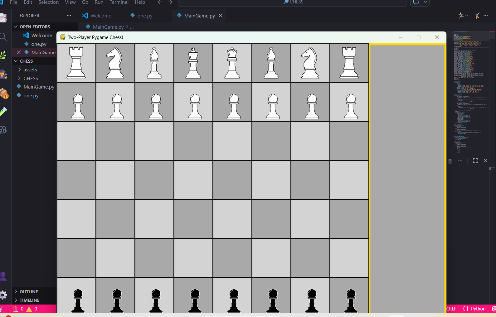

# Chess Game in Python

A fully functional Chess Game developed using Python.  
This project implements core chess rules, piece movements, and game logic.

---

## Features

- Standard 8x8 Chess Board
- All chess pieces with valid movements
- Turn-based gameplay (White vs Black)
- Check and Checkmate detection
- Input validation
- Simple and clean interface

---

##  Technologies Used

- Python 3
- Pygame  Module
- Object-Oriented Programming (OOPs)

---

##  Project Structure
<pre>
Chess_Game_Python/
│── assets/(images)
├── MainGame.py
├── one.py
└── README.md

</pre>

---

## ▶ How to Run

1. Clone the repository:git clone https://github.com/your-username/Chess_Game.git (see https)
2. Navigate to project folder: cd Folder_name
3. Run the program: python main.py

---

##  Learning Outcomes

- Applied Object-Oriented Programming concepts
- Implemented game logic and state management
- Improved problem-solving skills
- Worked with Python data structures

---
##  Screenshots

##  Future Improvements

- Add GUI interface
- Add AI opponent
- Add move history
- Add timer feature

---

## 👩 Author
K.Leela
GitHub: https://github.com/Lahari-1214

---
If you like this project, give it a star!

